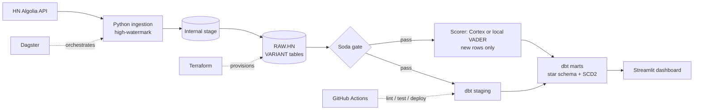

# snowflake-platform

A cloud data warehouse built the way a real team would: **infrastructure as code, tested transformations, CI/CD, and LLM-style enrichment inside the pipeline**, on Hacker News data.



## Highlights
- **Terraform** (`snowflakedb/snowflake`): warehouse (XS, `AUTO_SUSPEND=60`), resource monitor, `RAW`/`ANALYTICS`, roles `LOADER`/`TRANSFORMER`/`REPORTER`, key-pair service user, grants. Rebuilds from zero.
- **Incremental ingestion**: stored high-watermark, bisecting windows around Algolia's 1000-hit cap, `PUT` + `COPY INTO`.
- **dbt**: staging, star schema (`fct_comments`, `dim_story`, `dim_author`, `dim_date`), incremental models, one SCD2 snapshot, source freshness, `unique` / `not_null` / `relationships` / `accepted_values`.
- **Enrichment**: `snowflake.cortex.sentiment` + `classify_text` in an incremental dbt model, with a local VADER backend for accounts without Cortex (`--vars '{enrichment_backend: cortex}'`).
- **Data quality**: Soda checks (volume ratio, null rate, duplicates, freshness); a failed check blocks downstream Dagster assets.
- **CI/CD**: PRs run `sqlfluff`, `terraform fmt`/`validate`, `dbt build --select state:modified+` into an isolated schema; merges to `main` deploy to prod.

## Cost control
**Scoring is incremental**: each run enriches only comments that are not scored yet (`where comment_id not in (select comment_id from {{ this }})`), so LLM/compute cost grows with *new* data, not with table size. Warehouse is XS with `AUTO_SUSPEND = 60` and a resource monitor suspends it at its credit quota.

## Cost table
| Experiment | Elapsed (s) | Bytes scanned (MB) | Est. credits |
|---|---|---|---|
| Baseline (XS, views) | | | |
| fct_comments clustered by date_day | | | |
| stg_comments as table | | | |
| Warehouse S | | | |

_Fill with `docs/optimization.sql`._

## Run it
See [docs/RUNBOOK.md](docs/RUNBOOK.md).

## Tear down
```bash
cd terraform && terraform destroy
# then, in Snowflake as ACCOUNTADMIN, run docs/teardown.sql
```

