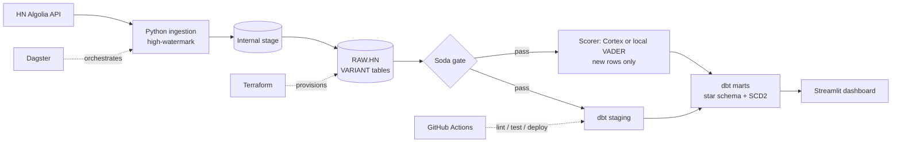

# snowflake-platform
 
An end-to-end data platform on Snowflake, built the way a real data team would: **infrastructure as code, incremental ingestion, tested transformations, orchestration with quality gates, CI/CD, and NLP enrichment**, using public Hacker News data.
 
**Stack:** Snowflake · Terraform · Python · dbt · Dagster · Soda · GitHub Actions · Streamlit
 

 
## Architecture
 

 
## Highlights
 
- **Terraform**: warehouse (XS, `AUTO_SUSPEND=60`), resource monitor, `RAW` / `ANALYTICS` databases, least-privilege roles (`LOADER`, `TRANSFORMER`, `REPORTER`), key-pair service user. The platform rebuilds from zero.
- **Incremental ingestion**: stored high-watermark, time windows split to get around the API's 1,000-hit cap, then `PUT` + `COPY INTO`.
- **dbt**: staging models, star schema (`fct_comments`, `dim_story`, `dim_author`, `dim_date`), incremental models, one SCD2 snapshot, source freshness, and `unique` / `not_null` / `relationships` / `accepted_values` tests.
- **Enrichment**: sentiment and topic per comment, with a Cortex backend and a local VADER backend for accounts without Cortex (`--vars '{enrichment_backend: cortex}'`).
- **Data quality**: Soda checks (volume, nulls, duplicates, freshness). A failed check blocks downstream Dagster assets.
- **CI/CD**: pull requests run `sqlfluff`, `terraform fmt/validate` and `dbt build --select state:modified+` in an isolated schema. Merges to `main` deploy to prod.
## Cost control
 
Scoring is incremental: each run enriches only comments not yet scored (`where comment_id not in (select comment_id from {{ this }})`), so cost grows with new data, not table size. The warehouse auto-suspends after 60 seconds and a resource monitor caps monthly credits.
